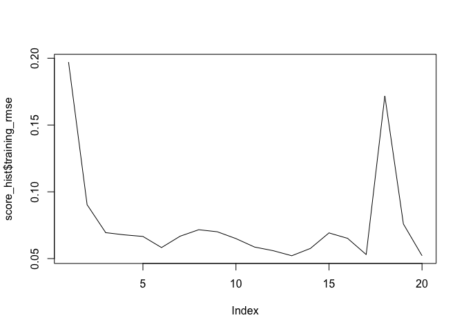
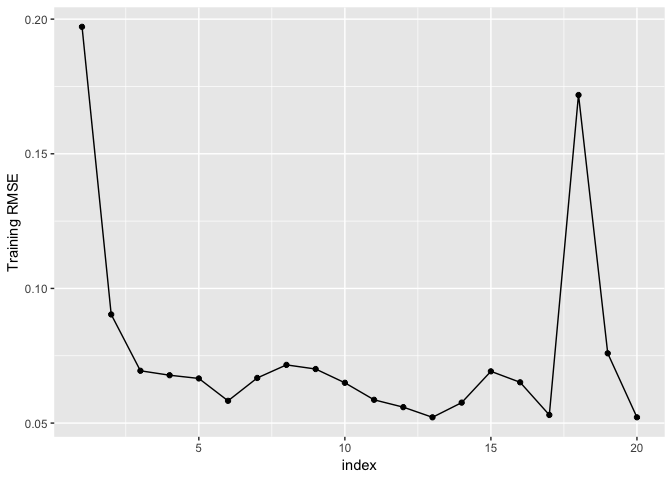

### Data analysis

```r
summary(airlines)
```

```
##       Year          Month          DayofMonth     DayOfWeek    
##  Min.   :1987   Min.   : 1.000   Min.   : 1.0   Min.   :1.000  
##  1st Qu.:1992   1st Qu.: 1.000   1st Qu.: 6.0   1st Qu.:2.000  
##  Median :1998   Median : 1.000   Median :14.0   Median :4.000  
##  Mean   :1998   Mean   : 1.409   Mean   :14.6   Mean   :3.821  
##  3rd Qu.:2003   3rd Qu.: 1.000   3rd Qu.:23.0   3rd Qu.:5.000  
##  Max.   :2008   Max.   :10.000   Max.   :31.0   Max.   :7.000  
##                                                                
##     DepTime       CRSDepTime      ArrTime       CRSArrTime  
##  Min.   :   1   Min.   :   0   Min.   :   1   Min.   :   0  
##  1st Qu.: 929   1st Qu.: 910   1st Qu.:1118   1st Qu.:1109  
##  Median :1330   Median :1320   Median :1527   Median :1516  
##  Mean   :1346   Mean   :1313   Mean   :1505   Mean   :1485  
##  3rd Qu.:1735   3rd Qu.:1720   3rd Qu.:1917   3rd Qu.:1903  
##  Max.   :2400   Max.   :2359   Max.   :2400   Max.   :2359  
##  NA's   :1086                  NA's   :1195                 
##  UniqueCarrier        FlightNum        TailNum          ActualElapsedTime
##  Length:43978       Min.   :   1.0   Length:43978       Min.   : 16.0    
##  Class :character   1st Qu.: 204.0   Class :character   1st Qu.: 71.0    
##  Mode  :character   Median : 557.0   Mode  :character   Median :101.0    
##                     Mean   : 818.8                      Mean   :124.8    
##                     3rd Qu.:1242.0                      3rd Qu.:151.0    
##                     Max.   :3949.0                      Max.   :475.0    
##                                                         NA's   :1195     
##  CRSElapsedTime    AirTime         ArrDelay          DepDelay     
##  Min.   : 17    Min.   : 14.0   Min.   :-63.000   Min.   :-16.00  
##  1st Qu.: 71    1st Qu.: 61.0   1st Qu.: -6.000   1st Qu.: -2.00  
##  Median :102    Median : 91.0   Median :  2.000   Median :  1.00  
##  Mean   :125    Mean   :114.3   Mean   :  9.317   Mean   : 10.01  
##  3rd Qu.:151    3rd Qu.:140.0   3rd Qu.: 14.000   3rd Qu.: 10.00  
##  Max.   :437    Max.   :402.0   Max.   :475.000   Max.   :473.00  
##  NA's   :13     NA's   :16649   NA's   :1195      NA's   :1086    
##     Origin              Dest              Distance          TaxiIn       
##  Length:43978       Length:43978       Min.   :  11.0   Min.   :  0.000  
##  Class :character   Class :character   1st Qu.: 326.0   1st Qu.:  3.000  
##  Mode  :character   Mode  :character   Median : 541.0   Median :  5.000  
##                                        Mean   : 730.2   Mean   :  5.381  
##                                        3rd Qu.: 920.0   3rd Qu.:  6.000  
##                                        Max.   :3365.0   Max.   :128.000  
##                                        NA's   :35       NA's   :16026    
##     TaxiOut         Cancelled       CancellationCode      Diverted       
##  Min.   :  0.00   Min.   :0.00000   Length:43978       Min.   :0.000000  
##  1st Qu.:  9.00   1st Qu.:0.00000   Class :character   1st Qu.:0.000000  
##  Median : 12.00   Median :0.00000   Mode  :character   Median :0.000000  
##  Mean   : 14.17   Mean   :0.02469                      Mean   :0.002478  
##  3rd Qu.: 16.00   3rd Qu.:0.00000                      3rd Qu.:0.000000  
##  Max.   :254.00   Max.   :1.00000                      Max.   :1.000000  
##  NA's   :16024                                                           
##   CarrierDelay     WeatherDelay       NASDelay      SecurityDelay  
##  Min.   :  0.00   Min.   :  0.00   Min.   :  0.00   Min.   : 0.00  
##  1st Qu.:  0.00   1st Qu.:  0.00   1st Qu.:  0.00   1st Qu.: 0.00  
##  Median :  0.00   Median :  0.00   Median :  0.00   Median : 0.00  
##  Mean   :  4.05   Mean   :  0.29   Mean   :  4.86   Mean   : 0.02  
##  3rd Qu.:  0.00   3rd Qu.:  0.00   3rd Qu.:  0.00   3rd Qu.: 0.00  
##  Max.   :369.00   Max.   :201.00   Max.   :323.00   Max.   :14.00  
##  NA's   :35045    NA's   :35045    NA's   :35045    NA's   :35045  
##  LateAircraftDelay IsArrDelayed       IsDepDelayed      
##  Min.   :  0.00    Length:43978       Length:43978      
##  1st Qu.:  0.00    Class :character   Class :character  
##  Median :  0.00    Mode  :character   Mode  :character  
##  Mean   :  7.62                                         
##  3rd Qu.:  0.00                                         
##  Max.   :373.00                                         
##  NA's   :35045
```

```r
str(airlines)
```

```
## 'data.frame':	43978 obs. of  31 variables:
##  $ Year             : int  1987 1987 1987 1987 1987 1987 1987 1987 1987 1987 ...
##  $ Month            : int  10 10 10 10 10 10 10 10 10 10 ...
##  $ DayofMonth       : int  14 15 17 18 19 21 22 23 24 25 ...
##  $ DayOfWeek        : int  3 4 6 7 1 3 4 5 6 7 ...
##  $ DepTime          : int  741 729 741 729 749 728 728 731 744 729 ...
##  $ CRSDepTime       : int  730 730 730 730 730 730 730 730 730 730 ...
##  $ ArrTime          : int  912 903 918 847 922 848 852 902 908 851 ...
##  $ CRSArrTime       : int  849 849 849 849 849 849 849 849 849 849 ...
##  $ UniqueCarrier    : chr  "PS" "PS" "PS" "PS" ...
##  $ FlightNum        : int  1451 1451 1451 1451 1451 1451 1451 1451 1451 1451 ...
##  $ TailNum          : chr  NA NA NA NA ...
##  $ ActualElapsedTime: int  91 94 97 78 93 80 84 91 84 82 ...
##  $ CRSElapsedTime   : int  79 79 79 79 79 79 79 79 79 79 ...
##  $ AirTime          : int  NA NA NA NA NA NA NA NA NA NA ...
##  $ ArrDelay         : int  23 14 29 -2 33 -1 3 13 19 2 ...
##  $ DepDelay         : int  11 -1 11 -1 19 -2 -2 1 14 -1 ...
##  $ Origin           : chr  "SAN" "SAN" "SAN" "SAN" ...
##  $ Dest             : chr  "SFO" "SFO" "SFO" "SFO" ...
##  $ Distance         : int  447 447 447 447 447 447 447 447 447 447 ...
##  $ TaxiIn           : int  NA NA NA NA NA NA NA NA NA NA ...
##  $ TaxiOut          : int  NA NA NA NA NA NA NA NA NA NA ...
##  $ Cancelled        : int  0 0 0 0 0 0 0 0 0 0 ...
##  $ CancellationCode : chr  NA NA NA NA ...
##  $ Diverted         : int  0 0 0 0 0 0 0 0 0 0 ...
##  $ CarrierDelay     : int  NA NA NA NA NA NA NA NA NA NA ...
##  $ WeatherDelay     : int  NA NA NA NA NA NA NA NA NA NA ...
##  $ NASDelay         : int  NA NA NA NA NA NA NA NA NA NA ...
##  $ SecurityDelay    : int  NA NA NA NA NA NA NA NA NA NA ...
##  $ LateAircraftDelay: int  NA NA NA NA NA NA NA NA NA NA ...
##  $ IsArrDelayed     : chr  "YES" "YES" "YES" "NO" ...
##  $ IsDepDelayed     : chr  "YES" "NO" "YES" "NO" ...
```
There are a total of 31 columns where 7 of those are strings and possibly factors. We will try to figure out which are the factor columns and convert them to `factor` next!

### Subset chracter columns from the airline dataset

```r
non_numeric_columns <- airlines[, sapply(airlines, class) == "character"]
```

### Counting number of unique values from `non_numeric_columns`

```r
# Function to return unique value count
unique_count <- function(x) {
    length(unique(x))
}
sapply(non_numeric_columns, unique_count) # apply function to non_numeric_columns
```

```
##    UniqueCarrier          TailNum           Origin             Dest 
##               10             3502              132              134 
## CancellationCode     IsArrDelayed     IsDepDelayed 
##                5                2                2
```
Prbably can convert `UniqueCarrier`, `Origin`, `Dest`, `ConcellationCode`, `IsArrDelayed` and `IsDepDelayed` to `factor`.

### Converting columns to factor

```r
n <- names(non_numeric_columns[-2])

airlines[, c(paste(n, sep = ", "))] <- as.data.frame(sapply(airlines[, c(paste(n, sep = ", "))], as.factor))
str(airlines)
```

```
## 'data.frame':	43978 obs. of  31 variables:
##  $ Year             : int  1987 1987 1987 1987 1987 1987 1987 1987 1987 1987 ...
##  $ Month            : int  10 10 10 10 10 10 10 10 10 10 ...
##  $ DayofMonth       : int  14 15 17 18 19 21 22 23 24 25 ...
##  $ DayOfWeek        : int  3 4 6 7 1 3 4 5 6 7 ...
##  $ DepTime          : int  741 729 741 729 749 728 728 731 744 729 ...
##  $ CRSDepTime       : int  730 730 730 730 730 730 730 730 730 730 ...
##  $ ArrTime          : int  912 903 918 847 922 848 852 902 908 851 ...
##  $ CRSArrTime       : int  849 849 849 849 849 849 849 849 849 849 ...
##  $ UniqueCarrier    : Factor w/ 10 levels "AA","CO","DL",..: 6 6 6 6 6 6 6 6 6 6 ...
##  $ FlightNum        : int  1451 1451 1451 1451 1451 1451 1451 1451 1451 1451 ...
##  $ TailNum          : chr  NA NA NA NA ...
##  $ ActualElapsedTime: int  91 94 97 78 93 80 84 91 84 82 ...
##  $ CRSElapsedTime   : int  79 79 79 79 79 79 79 79 79 79 ...
##  $ AirTime          : int  NA NA NA NA NA NA NA NA NA NA ...
##  $ ArrDelay         : int  23 14 29 -2 33 -1 3 13 19 2 ...
##  $ DepDelay         : int  11 -1 11 -1 19 -2 -2 1 14 -1 ...
##  $ Origin           : Factor w/ 132 levels "ABE","ABQ","ACY",..: 107 107 107 107 107 107 107 107 107 107 ...
##  $ Dest             : Factor w/ 134 levels "ABE","ABQ","ACY",..: 119 119 119 119 119 119 119 119 119 119 ...
##  $ Distance         : int  447 447 447 447 447 447 447 447 447 447 ...
##  $ TaxiIn           : int  NA NA NA NA NA NA NA NA NA NA ...
##  $ TaxiOut          : int  NA NA NA NA NA NA NA NA NA NA ...
##  $ Cancelled        : int  0 0 0 0 0 0 0 0 0 0 ...
##  $ CancellationCode : Factor w/ 4 levels "","A","B","C": NA NA NA NA NA NA NA NA NA NA ...
##  $ Diverted         : int  0 0 0 0 0 0 0 0 0 0 ...
##  $ CarrierDelay     : int  NA NA NA NA NA NA NA NA NA NA ...
##  $ WeatherDelay     : int  NA NA NA NA NA NA NA NA NA NA ...
##  $ NASDelay         : int  NA NA NA NA NA NA NA NA NA NA ...
##  $ SecurityDelay    : int  NA NA NA NA NA NA NA NA NA NA ...
##  $ LateAircraftDelay: int  NA NA NA NA NA NA NA NA NA NA ...
##  $ IsArrDelayed     : Factor w/ 2 levels "NO","YES": 2 2 2 1 2 1 2 2 2 2 ...
##  $ IsDepDelayed     : Factor w/ 2 levels "NO","YES": 2 1 2 1 2 1 1 2 2 1 ...
```
Now we have 6 factor variables, 1 character variable ("TailNum") and 24 integer variablers

### Convert df to h2o objects

```r
h2o_airlines <- as.h2o(airlines)
```

```
## 
  |                                                                       
  |                                                                 |   0%
  |                                                                       
  |=================================================================| 100%
```

```r
# Separating frames to train, valid and test sets
parts <- h2o.splitFrame(h2o_airlines, 0.8, seed = 123)
train <- parts[[1]]
test <- parts[[2]]

x <- names(airlines)
```

### Apply h2o deeplearning autuencoder

```r
m <- h2o.deeplearning(x,
                      training_frame = train,
                      autoencoder = TRUE,
                      epochs = 200,
                      model_id = "dp_autoencoder",
                      train_samples_per_iteration = nrow(train),
                      score_interval = 0,
                      score_duty_cycle = 1.0,
                      hidden = c(200, 200),
                      activation = "Tanh"
                      )
```

```
## Warning in .h2o.startModelJob(algo, params, h2oRestApiVersion): Dropping bad and constant columns: [TailNum].
```

```
## 
  |                                                                       
  |                                                                 |   0%
  |                                                                       
  |=                                                                |   1%
  |                                                                       
  |=                                                                |   2%
  |                                                                       
  |==                                                               |   2%
  |                                                                       
  |==                                                               |   3%
  |                                                                       
  |==                                                               |   4%
  |                                                                       
  |===                                                              |   4%
  |                                                                       
  |===                                                              |   5%
  |                                                                       
  |====                                                             |   6%
  |                                                                       
  |=====                                                            |   7%
  |                                                                       
  |=====                                                            |   8%
  |                                                                       
  |======                                                           |   8%
  |                                                                       
  |======                                                           |   9%
  |                                                                       
  |=================================================================| 100%
```

### Model analysis

```r
score_hist <- as.data.frame(h2o.scoreHistory(m))
score_hist
```

```
##              timestamp          duration  training_speed epochs iterations
## 1  2018-09-22 19:46:59         1.578 sec 0.00000 obs/sec      0          0
## 2  2018-09-22 19:47:55        56.493 sec     656 obs/sec      1          1
## 3  2018-09-22 19:48:40  1 min 41.933 sec     719 obs/sec      2          2
## 4  2018-09-22 19:49:26  2 min 27.758 sec     741 obs/sec      3          3
## 5  2018-09-22 19:50:11  3 min 13.476 sec     753 obs/sec      4          4
## 6  2018-09-22 19:50:57  3 min 58.996 sec     761 obs/sec      5          5
## 7  2018-09-22 19:51:43  4 min 44.505 sec     767 obs/sec      6          6
## 8  2018-09-22 19:52:29  5 min 30.549 sec     769 obs/sec      7          7
## 9  2018-09-22 19:53:17  6 min 18.970 sec     766 obs/sec      8          8
## 10 2018-09-22 19:54:02  7 min  4.286 sec     770 obs/sec      9          9
## 11 2018-09-22 19:54:48  7 min 49.870 sec     772 obs/sec     10         10
## 12 2018-09-22 19:55:35  8 min 36.846 sec     772 obs/sec     11         11
## 13 2018-09-22 19:56:21  9 min 23.045 sec     773 obs/sec     12         12
## 14 2018-09-22 19:57:08 10 min 10.236 sec     772 obs/sec     13         13
## 15 2018-09-22 19:57:56 10 min 58.109 sec     771 obs/sec     14         14
## 16 2018-09-22 20:00:35 13 min 37.527 sec     663 obs/sec     15         15
## 17 2018-09-22 20:01:31 14 min 33.650 sec     661 obs/sec     16         16
## 18 2018-09-22 20:02:26 15 min 28.576 sec     661 obs/sec     17         17
## 19 2018-09-22 20:03:23 16 min 25.725 sec     660 obs/sec     18         18
## 20 2018-09-22 20:03:25 16 min 27.107 sec     660 obs/sec     18         18
##    samples training_rmse training_mse
## 1        0    0.19714224  0.038865063
## 2    35255    0.09034103  0.008161502
## 3    70510    0.06942405  0.004819699
## 4   105765    0.06777301  0.004593181
## 5   141020    0.06657884  0.004432742
## 6   176275    0.05826321  0.003394602
## 7   211530    0.06675940  0.004456818
## 8   246785    0.07161448  0.005128634
## 9   282040    0.07007387  0.004910348
## 10  317295    0.06496210  0.004220075
## 11  352550    0.05864203  0.003438888
## 12  387805    0.05591754  0.003126771
## 13  423060    0.05214407  0.002719004
## 14  458315    0.05760192  0.003317982
## 15  493570    0.06922022  0.004791439
## 16  528825    0.06514720  0.004244157
## 17  564080    0.05301966  0.002811085
## 18  599335    0.17182333  0.029523256
## 19  634590    0.07590918  0.005762204
## 20  634590    0.05214407  0.002719004
```

```r
plot(score_hist$training_rmse, type = "l")
```

<!-- -->

```r
score_hist %>%
    ggplot(aes(x = (as.numeric(row.names(score_hist))), y = training_rmse)) +
    geom_line() +
    geom_point() +
    xlab("index") +
    ylab("Training RMSE")
```

<!-- -->


